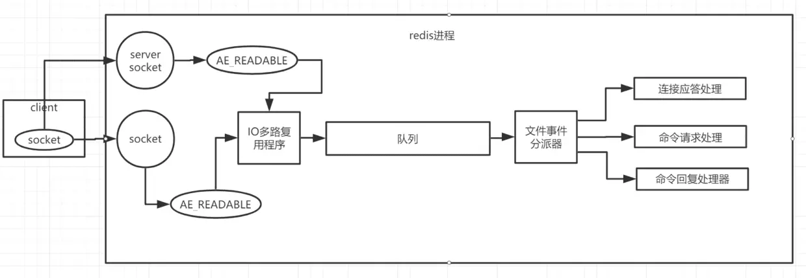

# 高频面试问题分享

## 一、Mysql相关

### 		1、mysql数据结构(B+Tree)（理解透彻）

#### 			  1）、什么是索引（Index）？

​				   本质是**帮助MySQL高效获取数据**的**数据结构**，**MySql**中主要应用的索引数据结构为**B+Tree**。

#### 			 2）、索引结构类型有哪些？

​					Mysql存储引擎主要有**MySIAM**、**InnoDB**。而各种存储引擎对索引的支持也各不相同，因此MySQL数据库支持多种索引类型，如**B+Tree索引**，**哈希索引**，**全文索引**等等


#### 			  3）、mysql数据和索引存储位置？

​					**MySIAM**的索引和数据分两个文件进行存储：MYI文件存储索引(B+树)、MYD文件存储数据 

​					**InnoDB**的索引和数据存储在一个文件中：ibd文件（B+树）

	SHOW VARIABLES LIKE 'innodb_page_size'
	SHOW GLOBAL STATUS LIKE 'innodb_page_size'


#### 			  4）、存储数据结构？

​        		    MySIAM、InnoDB两种存储引擎都是基于B+树数据结构存储表数据的。不同之处是：

​					**MySIAM**的B+树**只存储了索引key值**，真正的数据存储在别的地方 

​				    **InnoDB** 存储引擎中的B+树既**存储了索引也存储了数据**		

​					B+Tree结构示例图

​					

​					

#### 			  5）、节点数据项存储的是什么？

​				    **InnoDB**：

​							对于主键索引（聚集索引）：**非叶子结点**存储的是**ID值**，**叶子结点**存储的为**完整的数据**

​							对于非主键索引（非聚集索引）：**非叶子结点**存储的是**索引列的值**，**叶子结点**存储的为**主键ID值**

​					**MySIAM**：**非叶子节点存储**的是**索引列的值**，**叶子结点存储**的为**真实数据所在的地址**。

#### 			  6）、为什么使用B+tree

​					由于数据存储于物理磁盘，所以要尽量减少从磁盘IO数据的次数，有效手段有：

​	    				1、磁盘局部预读原理，预读的大小通常为Page的倍数；

​						2、选取合适的数据结构存储数据，从磁盘IO次数越小越好，如BTree，渐进复杂度为O(h)=O(logdN)O(h)=O(logdN)，一般实际应用中，出度d 

​                              是非常大的数字，通常超过100，因此树的高度h非常小（通常不超过3层可容纳千万级数据）。所以，B+tree作为mysq数据库的数据结构搜索效率是很高的

#### 			  7）、B+tree与B-tree联系和区别

​					（1）、B+tree是B-tree的变体；

​					（2）、在B-tree的基础上增加了叶子结点间的顺序访问指针，B+Tree提高了顺序访问的性能；

​					（3）、B+tree非叶子结点只存储索引值，叶子结点存储真实数据，B-tree所有结点上都存储数据；

​								所以B+tree的高度更低，数据查找性能也更加稳定

#### 		      8）、聚集索引、非聚集索引

​					聚集索引：**又叫主键索引**，有个特点是数据库表行中数据的**物理存储顺序与数据的逻辑顺序相同**，一张表中**只允许存在一个聚集索引**，对于mysql来说**一般就是主键**， 若无主键则为表中第一个非空的唯一索引，还是没有，就采用InnoDB存储引擎为每行数据内置的ROWID 作为聚集索引 ；**聚集索引**就是按照每张表的**主键构造一颗B+树**，同时**叶子节点中存放的即为整张表的记录数据**。聚集索引的叶子节点称为数据页，聚集索引的这个特性决定了索引组织表中的数据也是索引的一部分。

​					非聚集索引：**又叫辅助索引、二级索引**。是指除了聚集索引外的其他索引，该索引中索引的**逻辑顺序与磁盘上行的物理存储顺序不同**，一个表中可以拥有 **多个非聚集索引**。数据的逻辑顺序可能相邻，但是数据的实际存储物理地址可能相差十万八千里 ；非聚集索引的叶子节点**存储主键**

#### 			  9）、覆盖索引      

select  id   from table where phone = 1800000000;


(age,name,phone）  

select   sex,name,phone,id   from table where age = 23;


​		 这个概念就是指select的数据列**只用从索引中就能够取得**，不必从聚集索引中的叶子结点数据项中读取，换句话说**查询列要被所使用的索引覆盖**。 索引是高效找到行的一 个方法，当能通过检索 索引就可以读取想要的数据，那就不需要再到数据表中读取行了。如果一个索引包含了（或覆盖了）满足查询语句中字段与条件的数据就叫做覆盖索引。在mysql中只**能使用BTree索引做覆盖索引**、Hash索引不行 如果实现了覆盖索引，在**explain**的**Extra**列可以看到**“Using index”**的信息

#### 		     10）、查询过程

​				 （1）、**对于聚集索引（主键索引）**来说，也就是通过主键查询，**一次查询**就能查询到**具体的行数据信息**；

​				 （2）、**对于非聚集索引来说（唯一索引、普通索引、全文索引）**

​							 如果**需要查询的数据列在索引中**，如A+B联合索引，根据A去查询B，则**通过一次查询**就能直接拿到索引上的数据，也就是**覆盖索引**现象；


​				  		   如果**需要查询的数据不在索引中**，则需要先**去普通索引树中进行第一次查找**得到行数据的**主键值**，然后**通过主键值去主 键索引树**中第二次搜索**得到真实**数据**，这种需要二次查询的现象叫做回表查询**。

详细解释：            

​									 从普通索引无法直接定位行记录，那**普通索引的查询过程是怎么样的呢？**通常情况下，需要扫码两遍索引树。

例如：select * from t where phone='18809098989';***是如何执行的呢？**

​				


####           11）、B+Tree性质

​					（1）.我们知道**IO次数**取决于**B+树**的**高度h**，假设当前**数据表的数据为N**，**每个磁盘块的数据项的数量是m**，则有**h=㏒(m+1)N**，当**数据量N一定的情**况下，**m越大**，**h越小**；而**m = 磁盘块的大小 / 数据项的大小**，磁盘块的大小也就是一个数据页的大小，是固定的，如果**数据项占的空间越小**，**数据项的数量越多**，**树的高度越低**。这就是为什么每个数据项，即索引字段要尽量的小，比如int占4字节，要比bigint8字节少一半。这也是为什么b+树要求把真实的数据放到叶子节点而不是内层节点，一旦放到内层节点，磁盘块的数据项会大幅度下降，导致树增高。当数据项等于1时将会退化成线性表。

​					（2）.当**B+树的数据项是复合的数据结构**，也就是**联合索引**比如(name,age,sex)的时候，b+树是按照从**左到右的顺序**来建立搜索树的，比如当(张三,20,F)这样的数据来检索的时候，b+树会优先比较name来确定下一步的所搜方向，如果name相同再依次比较age和sex，最后得到检索的数据；当(20,F)这样的没有name的数据来的时候，b+树就不知道下一步该查哪个节点，因为建立搜索树的时候name就是第一个比较因子，必须要先根据name来搜索才能知道下一步去哪里查询。比如当(张三,F)这样的数据来检索时，b+树可以用name来指定搜索方向，但下一个字段age的缺失，所以只能把名字等于张三的数据都找到，然后再匹配性别是F的数据了， 这个是非常重要的性质，即**索引的最左匹配特性原则**。


#### 		 12）、B+Tree  IO数据查找示意图 

select name

select  name,age

select  name,age,phone

select  phone,age,name

select  name,phone 


### 2、mysql优化

#### 			1）、优化SQL语句层面（理解透彻）

​					1）、尽量避免使用select  *；

​					2）、规范sql语句大小写，sql是有缓存的，避免每次都需要解析；

​	                3）、使用exsits代替in，要更高效（在外表大的时用in效率更快，内表大用exists更快。）；

​					4）、mysql sql where 和 from解析执行过程从右至左，基于这个规则，from后面能过滤掉更多数据的基础表放后面，where后面能过滤掉更多数据的查询条件放后面；

​					FROM、ON、JOIN、WHERE、GROUPBY、HAVING、SELECT、DISTINCT、ORDER BY、LIMIT

​					6）、合理使用索引  

```
1、为合适的列添加索引(主键、唯一索引、组合索引、普通索引)；
    1)、索引字段不宜过大
    2)、查询频繁字段建索引（查询频繁业务字段，关联字段）
    3)、区分度要高
    4)、索引不是越多越好 	
2、尽量建立联合索引，也省空间成本；   a,b,c  （a    a and b    a and b and c    a  AND C）  
 
    b   b and c   c                a and c      b and a 
3、尽量使用覆盖索引；  a,b,c      SELECT C  FROM TABLE WHERE A= '' AND B = '';
4、避免以下会使索引失效的操作
    1）、使用is not null不走索引
    2）、各种负向查询not ，not in， not like ，<> ,!= ,!> ,!<  不会使用索引
    3）、like将%放左边不走索引
    4）、查询条件的数据类型做了隐式转换(比如varchar类型字段用int去查)
    5）、使用in或union代替or，or除了两侧都是索引才会走索引，其他不会走索引
    6）、尽量保持索引列干净，不在索引列上使用函数转换、运算
    7）、联合索引要遵循最左匹配原则.
			如建立联合索引（A,B,C）,查询顺序如下：
		ABC会走索引，AB会走索引，A也会走索引，但是不能断开，如|BC|CB|B|C都不会走索引
	8）、使用比较运算或between会使联合索引从使用比较运算的下一个索引处断开
```

​					7）、explain命令进行sql慢查询排查		

​						对于执行**查询很慢的sql**，通常对sql语句执行**explain**命令进行分析，具体信息如下：

​						1. id //select查询的序列号，包含一组数字，表示查询中执行select子句或操作表的顺序，id相同，执行顺序从上至下 //id值越大，优先级越高，越先执行

​	                    2. select_type //查询类型 SIMPLE、PRIMARY、SUBQUERY、DERIVED、UNION、UNION RESULT

​	                    3. table   //正在访问哪个表

​	                    4. partitions //匹配的分区

​	                    5. type //访问的类型  效率从快到慢：	const>eq_ref>ref>ref_or_null>index_merge>range>index>ALL

​	                    6. possible_keys //显示可能应用在这张表中的索引，一个或多个，但不一定实际使用到

​	                    7. key    //实际使用到的索引，如果为NULL，则没有使用索引

​	                    8. key_len //表示索引中使用的字节数，可通过该列计算查询中使用的索引的长度

​	                    9. ref   //显示索引的哪一列被使用了，如果可能的话，是一个常数，哪些列或常量被用于查找索引列上的值

​	                   10. rows //根据表统计信息及索引选用情况，大致估算出找到所需的记录所需读取的行数，这个数量越小越好

​	                   11. filtered //查询的表行占表的百分比

​	                   12. Extra //包含不适合在其它列中显示但十分重要的额外信息

#### 		   2）、优化架构方面（了解） 

​		 在数据达到一定量级以后，需要对数据库从主从 、分库分表数据分片方面进行优化：

​						   **读写分离**：主节点写，从节点读    sharding-jdbc

​						   **分库**：根据业务或者其他维度把数据存放到不同数据库

​						   **分表**：

​									1、水平分表：字段都一样，分多张表存放不同时间范围或不同维度的数据，如实时数据表、历史数据																	表。

​									2、垂直分表：将不同字段放在多张表，使用外键关联。

​							常用**分库分表中间件**：阿里的Cobar及开源社区基于Cobar维护的Mycat等。


### 3、mysql事务（理解透彻）

#### 		1）、事务有哪些特性？

- ​			**原子性**：事务中所有操作要么全部提交成功，要么全部失败回滚，不能出现一部分失败，一部分成功的现象；

- ​			**一致性**：指在事务的执行前后保持数据库的一致性；

- ​			**隔离性**：一个事务所做的修改在最终提交之前，对其他事务是不可见的；

- ​			**永久性**：一旦事务提交，它所做的修改将会永久保存到数据库中，及时系统发生崩溃，事务执行结果也不会丢失；

####         2）、哪几种事务隔离级别，会出现的问题？

|     事务隔离级别     | 脏读 | 同行数据两次读取结果不一致（不可重复读） | 幻读 |
| :------------------: | ---- | ---------------------------------------- | ---- |
| （read-uncommitted） | 是   | 是                                       | 是   |
|  （read-committed）  | 否   | 是                                       | 是   |
| （repeatable-read）  | 否   | 否                                       | 是   |
|   （serializable）   | 否   | 否                                       | 否   |


####         3）、脏读、不可重复读、幻读

- ​			**脏读**：**一个事物**读到了**另一个事务尚未提交**的数据，不符合事务的隔离性。

- ​			**不可重复读**：**同一个事务中**针**对同一行记录两次**读出来的**结果不一样**，原因就是第二次读到了其他事务**修改提交**的数据。

- ​			**幻读**：**同一个事务中**针对**同一范围内的数据**两次读出来的**结果不一样**，原因就是第二次读到了其他事务**新增提交**的数据。

  


#### 		4）、mysql和oracle默认事务隔离级别

- ​			**mysql默认隔离级别**：repeatable-read，但是一般会设置为read-committed，因为在实际业务中常常是：一个事务中需要读到别的事务提交修改的数据。

- ​			**oraclel默认隔离级别**：read-committed


### 4、mysql其它问题

#### 1）、MyISAM与 Innodb 两种存储引擎的区别?

- ​		  InnoDB  **支持事务和外键**，MyISAM**不支持**
- ​		  InnoDB  **支持行锁**，MyISAM只支持**表锁**
- ​		  InnoDB  的真实数据和索引存储在**同一个文件中**，而MyISAM存储在**两个文件中**
- ​		  InnoDB  5.6之前不支持全文索引，而 MyISAM 支持。

#### 2）、乐观锁与悲观锁

​	  **乐观锁：**

​					思想为：**乐观的认为**本次事务操作数据**不会有别的事务干扰**，操作数据前**不进行加锁**，只是**预先记录版本号**，真正修改数据时**再进行比对**，

​									如果版本号没变则修改数据，版本号变了则表明别的事务在本次事务过程中修改了数据，本次事务不修改数据。

​					具体步骤：

​								1、先查出版本号：select status,version from t_goods where id=#{id} 

​								2、真正修改数据时进行版本号比对修改：update t_goods set status=2,version=version+1  where id=#{id} and version=#{version};	

​	**悲观锁：**

​				思想为：**悲观的认为**本次事务**一定会有别的事务干扰**，操作数据前**必须先加锁**

​				常见实现方式为 for update加**行锁**： select ... from table where id = #{id} for update，这里注意，由于**mysql锁是建立在索引上面**的，所以查询条件必须用**主键索引**或者是唯一索引，否则会造成**表锁**。

#### 3）、char和vachar区别

​		     **char列长度固定**，为创建表时声明的长度，长度值范围是1到255，当char值未填满指定长度时，其他空间会用**空格**进行填充，检索CHAR值时需删除尾随空格。

​			 **vachar长度为可变的**，实际使用多少空间就占多少空间。

#### 4）、使用varchar（255）的字段建索引可以吗？

​	      理论上是可以的，拿Innodb和utf编码场景来说，索引长度极限为 767字节，utf8 编码时1个字符占3个字节，varchar 类型能建立索引的最大长度为

​		  767/3 = 255，这也是为什么varchar一般设置最大长度为255的原因之一，但是实际业务场景中一般不会建如此大的索引，影响检索效率。


## 二、Redis相关

### 		1、支持哪几种数据类型	  

​		支持五种数据类型：string（字符串），hash（哈希），list（列表），set（集合）及zset(sorted set：有序集合)。

### 		2、为什么读写速度很快

- ​						redis完全基于内存
- ​						数据结构简单
- ​						采用单线程，避免了加锁、释放锁、死锁、线程间切换等消耗
- ​						使用多路I/O复用模型，非阻塞IO

### 		3、在你们项目有哪些应用场景

**计数器**：对 string 进行自增自减运算，从而实现计数器功能。redis 内存型数据库的读写性能非常高，很适合存储频繁读写的计数量。如每日登录次数计数。

**热点数据缓存**：将热点数据放到内存中。如首页排行榜数据，具有很大访问频次，使用zset可以实现基于score分数排序；。

**会话缓存**：用redis统一存储多台应用服务器的会话信息。当应用服务器不再存储用户的会话信息，也就不再具有状态，一个用户可以请求任意一个应用服务器，从而更容易实现高可用性以及可伸缩性。

**取数据交集、并集**：基于redis  set 的特性可以对共同好友进行很方便的查询。

**分布式事务锁的使用**：基于set lock requestId nx ex time 模式可以很方便编写分布式事务锁


### 4、基于什么协议

 Redis 的通信协议是 Redis Serialization Protocol，翻译为 Redis 序列化协议，简称 **RESP**

- ​		在 TCP 层
- ​		是二进制安全的
- ​		基于请求 - 响应模式
- ​		简单、易懂（人都可以看懂）

### 5、线程模型是怎样的？

​	**Redis 的线程模型**：基于非阻塞的IO多路复用机制的线程模型，**单线程**

​	Redis 是基于 **reactor** 模式开发了**网络事件处理器**，这个处理器叫做**文件事件处理器**（file event handler）。由于这个文件事件处理器是**单线程的**，所以 Redis 才叫做

​	**单线程的模型**。采用 **IO 多路复用机制同时监听多个 Socket**，根据 **socket 上的事件**来选择对应的**事件处理器**来**处理这个事件**。模型如下图：

  

上图得知，文件事件处理器的结构包含了四个部分：

- **多个 Socket**：客户端发起多个 socket，每个socket 会产生不同的事件，不同的事件对应着不同的操作
- **IO 多路复用程序**：IO 多路复用程序监听着这些 Socket，当这些 Socket 产生了事件，IO 多路复用程序会将这些事件放到一个队列中。
- **文件事件分派器**：通过队列，将事件以有序、同步、每次一个事件的方式向文件事件分派器中传送，文件事件分派器将事件按类型分派给不同的事件处理器进行处理。
- **事件处理器**：分为连接应答处理器、命令请求处理器、命令回复处理器，每个处理器对应不同的 socket 事件。

### 6、持久化机制是怎样的？

​		**第一种：RDB**，即 Redis 的内存快照，默认持久化机制，它是在某一个时间点将 Redis 的内存数据**全量**写入一个临时文件，当写入完成后，用该临时文件**替换**上一次持久化生成的文件，这样就完成了一次持久化过程，默认的文件名为**dump.rdb**。

​				 **1）、触发RDB机制：**

​								**（1）、save触发方式**：该命令会阻塞当前Redis服务器，执行save命令期间，Redis不能处理其他命令，直到RDB过程完成为止。具体流程如下：

​								

​							**（2）**、**bgsave触发方式**：执行该命令时，Redis会在后台异步fork出一个子进程进行快照操作，快照同时还可以响应客户端请求。具体流程如下：

​							

​						**（3）、自动触发**自动触发是由我们的配置文件来完成的。在redis.conf配置文件中，里面有如下配置，我们可以去设置：

​						           **save配置** 这里是用来配置触发 Redis的 RDB 持久化条件，也就是什么时候将内存中的数据保存到硬盘。比如“save m n”。表示m秒内数据集存在n次

​									修改时，自动触发bgsave。

​				**2）、优点：**

​								>由于 RDB 文件是一个非常紧凑的**二进制文件**，所以加载的速度会快于 AOF 方式;

​								>fork 子进程方式，除了fork线程阶段，其他时候不会阻塞;

​								>RDB 文件代表着 Redis 服务器的某一个时刻的全量数据，所以它非常适合做冷备份和全量复制的场景;

​				**3）、缺点：**

​								>没办法做到实时持久化，会存在丢数据的风险。定时执行持久化过程，如果在这个过程中服务器崩溃了，则会导致这段时间的数据全部丢失。

​				

​		**第二种：AOF**，即 append only file，它是将**每一行**对 Redis 数据进行修改的**命令**以独立**日志**的方式**存储起来**。由于 Redis 是将“操作 + 数据” 以格式化的方式保存在日志文件中，他代表了这段时间所有对 Redis 数据的的操作过程，所以在数据恢复时，我们可以直接 replay 该日志文件，即可还原所有操作过程，达到恢复数据的目的。它的主要目的是**解决了数据持久化的实时性**。

​					注意：**AOF 默认关闭**，需要在配置文件 redis.conf 中开启，`appendonly yes`。

​					**1）、AOF 总共分为三个流程**：

​					（1）、**命令写入**：将命令写入**缓冲区**

​					（2）、**文件同步**：命令写入到缓冲区，然后根据不同的策略**刷到硬盘中**。Redis 提供提供了**三种不同的同步策略**：

​				

​					（3）、**文件重写**：随着命令的不断写入，AOF 文件会越来越庞大，直接的影响就是导致“数据恢复”时间延长，而且有些历史的操作是可以废弃的（比如超时、del等等），为了解决这些问题，Redis 提供了 “文件重写”功能，该功能有手动和自动两种方式触发。

​				  			 **重写AOF**主要做了以下事情：	

​							1、**已过期的数据**不在写入文件。			

​							2、**保留最终命令**。例如 set key1 value1 、set key1 value2、....set key1 valuen，类似于这样的命令，只需要保留最后一个即可。

​							3、**删除无用的命令**。例如 set key1 valuel;del key1,这样的命令也是可以不用写入文件中的。

​							4、**多条命令合并成一条命令**。例如 lpush list a、lpush list b、lpush list c，可以转化为 lpush list a b c					

​		        **2）、优点**

​         			> 相比于 RDB，**AOF 更加安全**，**默认同步策略**为 everysec 即**每秒同步一次**，所以顶多我们就失去一秒的数据；

​         			> 根据关注点不同，AOF 提供了不同的同步策略，我们可以根据自己的需求来选择；

​        			 > AOF 文件是以 append-only 方式写入，相比如 RDB 全量写入的方式，它**没有任何磁盘寻址的开销，写入性能非常高**；

​                **3）、缺点**

​					> 由于 AOF 日志文件是命令级别的，所以相比于 RDB 紧致的二进制文件而言它的加载速度会慢些。

​					> AOF 开启后，支持的写 QPS 会比 RDB 支持的写 QPS 低。

​		**第三种**：**RDB-AOF** 混合模式（鱼和熊掌可兼得的方案）

​			通过上面的介绍我们知道了 RDB 和 AOF 各有自己的优缺点，选择任意其一都需要接受他的缺点：

​						RDB 能够**快速地存储和恢复数据**，但是在**服务器宕机**时会**丢失大量的数据**，**没有保证**数据的**实时性**和**安全性**；

​						AOF 能够**实时持久化数据**并且**提高了数据的安全性**，但是在**存储和恢复数据方面**又会**消耗大量时间**；

​			Redis 4.0 推出了 **RDB-AOF 混合持久化**方案，该方案是在 **AOF 重写阶段**创建一个**同时包含 RDB 数据**和 **AOF 数据**的 **AOF 文件**，其中 **RDB 数据位于AOF 文件的**

​			**开头**，他存储了服务器开始执行重写操作时 Redis 服务器的数据状态（RDB 快照方案），**重写操作执行之后的 Redis 命令，则会继续 append 在 AOF 文件末尾**，

​			，一般这部分数据都会比较小。这样在 Redis 重启的时候，则可以**先加载 RDB 的内容**，然后**再加载 AOF 的日志内容**，这样**重启的效率**则会得到**很大的提升**，而且

​			由于在运行阶段 Redis 命令都会以 append 的方式写入 AOF 文件，保证了**数据的实时性和安全性**


### 7、慢查询如何排查？

​	Redis 执行命令分为**四个步骤**：发送命令、命令排队、**执行命令**、返回结果。**慢查询只关注步骤 3执行命令 的时间**，**所以没有慢查询并不代表客户端没有超时问题**。

​	Redis 慢查询可通过配置两个参数进行：

- `slowlog-log-slower-than`：设置慢查询预设的超时阈值，单位是微秒

- `slowlog-max-len`：表示慢查询日志存储的条数

  Redis 中有两种修改配置的方法，一种是修改配置文件，另一种是使用 `config set` 命令动态修改：

  

​	**slowlog-log-slower-than**：默认是 1000 微秒，QPS太小，实际生产建议把这个参数调的更小一些

​			它表示的是慢查询预设的超时阈值。它所阐述的意思是如果某条命令（如 `keys *`） 执行”很慢“，执行时间超过了设置的阈值，那么这条命令将会被记录到慢查询日志中。

​			 若设置 `slowlog-log-slower-than = 0`，则会记录所有命令

​	 		若设置 `slowlog-log-slower-than < 0`，则不会记录任何命令

​    **slowlog-max-len**：实际生产中这个参数可以设置得大一些，如1000以上，可以减缓慢查询被剔除的可能

​			Redis 会使用一个列表来存储慢查询日志，`slowlog-max-len` 就是该列表的最大长度。一个命令如果满足慢查询阈值条件则会加入到该列表来，但是如果该列表已经

​			处于最大长度时，那么会删除最开始的一条记录，然后将最新的命令插入到末尾，所以慢查询日志列表是一个**有限的先进先出**列表。

​	通过slowlog get [n]命令获取慢查询日志：

​	

返回的慢查询日志由 4 个属性组成：1、日志的标识 id 	2、发生的时间戳 	3、命令耗时 	4、执行的命令和参数


用户发起请求

redis   

mysql   ->  redis

### 8、缓存穿透？缓存击穿？缓存雪崩？

**缓存穿透：**是指**缓存和数据库中都没有的数据**，而用户**不断发起请求**，如发起为id为“-1”的数据或id为特别大不存在的数据。这时的用户很可能是攻击者，**攻击会导致数据库压力过大**。

​				

​			     **解决方案：**

​						1）、从缓存取不到的数据，在数据库中也没有取到，这时也可以将key-value对写为key-null，缓存有效时间可以设置短点，如30秒（设置太长会导致正常情况

​								也没法使用）。这样可以防止攻击用户反复用同一个id暴力攻击；

​						2）、引入布隆过滤器，过滤一些异常的请求。

​						3）、接口层增加校验，如用户鉴权校验，id做基础校验，id<=0的直接拦截；


**缓存击穿：**是指**缓存中没有但数据库中有的数据**（一般是缓存时间到期），这时由于**并发用户特别多**，同时**读缓存没读到数据**，又同时**去数据库去取数据**，引起**数据库压力瞬间增大**，造成过大压力。


​				**解决方案：**

​							1）、设置热点数据不过期；

​							2）、第一时间去数据库获取数据填充到redis中，但是这个过程需要加锁，防止所有线程都去读取数据库，一旦有一个线程去数据库获取数据了，其他线程取锁失败后可设置一个合理睡眠时间之后再去尝试去redis中获取数据；

```java
public class SingnObjectUtil{
    private Student s;
    
    public Student getStudent1(){
       if(s != null){
           return s;
       }
       return getStudent2();
    }
    
    private synchronized Student getStudent2(){
       if(s != null){
            return s;
       }
       s = new Student;
       return s;
}
```


**缓存雪崩**：缓存雪崩是指**缓存中数据大批量到过期时间**，而**查询数据量巨大**，引起**数据库压力过大甚至down机**。和缓存击穿不同的是，缓存击穿指并发查同一条数据，缓存雪				崩是大批量数据都过期了，大量数据都从redis中查不到，从而查数据库。

​				

​			   **解决方案**：

​							1）、缓存数据的过期时间设置随机，防止同一时间大量数据过期现象发生。

​							2）、如果缓存数据库是分布式部署，将热点数据均匀分布在不同的数据库中。

​							3）、允许的话，设置热点数据永远不过期。	

​							4）、要保证redis的高可用，可以使用主从+哨兵或redis cluster，避免服务器不可用；

​							5）、使用redis的持久化RDB+AOF组合策略，防止缓存丢失并且可以快速恢复数据；


### 9、相比**memcached**有哪些区别？

​		redis支持丰富数据类型，**支持字符串、链表、哈希、集合和有序集合**，Memcache对数据类型支持相对简单，**只支持字符串**

​		Redis将数据存在**内存和硬盘**上，这样能保证数据的持久性，Memecache把数据**全部存在内存之中**，断电后会挂掉，数据不能超过内存大小

​		redis**支持事务，操作都是原子性**，所谓的原子性就是对数据的更改要么全部执行，要么全部不执行

​		

### 10、键过期删除如何实现的？

redis中可以设置键的过期时间，到期后自动进行删除，那么redis中是怎么实现过期删除的？

**定时过期**：每个设置过期时间的key都需要**创建一个定时器**，到过期时间就会**立即清除**。该策略可以**立即清除过期的数**据，**对内存很友好**；但是会**占用大量的CPU资源**去处理

​				过期的数据，从而**影响缓存的响应时间和吞吐量**。

**惰性过期**：只有当**访问一个key时**，**才会判断该key是否已过期**，过期则清除。该策略可以**最大化地节省CPU资源**，却**对内存非常不友好**。**极端情况**可能出现**大量的过期key**

​				  **没有再次被访问**，从而不会被清除，**占用大量内存**。

**定期过期**：每隔一定的时间，会扫描**一定数量**的**数据库的expires字典**中**一定数量的key**，并清除其中已过期的key。该策略是前两者的一个**折中方案**。通过调整**定时扫描的时间**

​				**间隔**和**每次扫描的限定耗时**，可以在不同情况下使得CPU和内存资源达到**最优的平衡效果**。


### 11、分布式事务锁怎么实现的？会有什么问题？

 通过setnx上锁方式实现，但是不注意写法很可能会出现很多问题；

​		**错误用法**：先通过setnx上锁，再通过expire设置过期时间，最后执行完任务后手动del释放锁；

​		**场景一问题**（**死锁**）：通过setnx上锁后**出现异常**，导致**无法**去expire**设置锁的过期时间**，更**无法**最后去**手动释放锁**，造成**死锁**！

​		解决：使用上锁最新写法，**保证上锁、设置过期时间**一步完成的**原子性**：	**set(lockKey,value,nx,ex,exporeTime);**

​		**场景二问题**（**误删锁**）：**A机器**中**上锁并设置过期时间**完成以后后，系统出现了**阻塞**，导致**锁到了过期时间并自动删除**了，这时**还没有**执行

​											  **手动释放锁**的操作，这个时候**B机器上锁成功**，并去执行任务，**任务还未执行完**，**A机器**反应过来了，继续**执行了手动释放锁**的操作，**把B机器**

​											  上的**锁给误删了**。

​		解决：上锁同时**加上一个锁id**，如当前线程ID，将**锁id**存入**value**值并记录在变量中，**手动释放锁**的时候比较一下value中的锁id跟变量中id是否一致，也就是**判断一**

​				   **下是否自己还在持有锁**，如果不是，就不执行删除操作了。

​		**场景三问题**（**误删锁**）：这种误删锁是基于场景2**判断锁id**和**释放锁操作**这两步没有保证原子性所导致的。

​											    具体为：A机器**带锁id方式取锁、设置过期时间并执行完任务后**，希望通过判断比较锁id之后去释放锁，**判断通过后系统出现阻塞**，

​												阻塞到锁也到了过期时间自动释放了锁，这时还未进行手动释放锁操作，这个时候B机器上锁成功，并去执行任务，**任务还未执行完**，

​												**A机器**反应过来了，继续**执行了手动释放锁**的操作，**把B机器**上的**锁给误删了**。

​		解决：保证**判断锁和释放锁的原子性**：使用redis执行**LUA脚本**，保证**一步执行判断锁和释放锁**。

		String luaScript = 'if redis.call('get', KEYS[1]) == ARGV[1] then return redis.call('del', KEYS[1]) else return 0 end';

​		redisClient.eval(luaScript , Collections.singletonList(key), Collections.singletonList(threadId));

​		**场景四问题（锁续命）**：这种场景是指线程中任务还没执行完，锁就已经到过期时间，这种情况可以给任务执行线程添加守护线程，守护线程负责对锁的expire时间

​											   进行监控，每当到过期前一秒就对过期进行判断，如果任务还在进行且锁马上过期，则对过期时间重新进行设置。

​		**综上**：正确使用redis分布式事务锁需要保证两个原子性：

​						1、上锁和设置过期时间需要保证原子性；

​						2、 判断锁ID是否为自己所有和解锁需要保证原子性；

   	**补充**：其实关于上述四个场景的问题，使用redis客户端**Redisson**都能够得到很好的解决，redisson**内部已经实现了上述几点问题的解决机制**，原理同上。	

## 三、多线程相关

### 1、线程相关

#### 		**1）、创建线程有哪几种方式？**

​				1、继承Thread类

​				2、实现Runable接口

​				3、实现带返回值的Callable接口

​				4、使用线程池创建线程

#### 		**2）、继承Thread类和实现Runable接口方式区别**

​				1、java是**单继承**，继承Thread后不能继承别的类，**有局限性**，但是java可以**多实现**，通过实现Runabel接口后还可以实现别的接口，可以**间接实现多继承**，

​						健壮性更高；

​				2、**Runable**接口是多线程中的上帝，主要就是用来**封装任务**，Thread类也是**通过实现它而来**；

​				3、使用Runable接口可以很方便对**共享资源**进行传入；

#### 		**3）、线程状态有几种?**

​				**新建**（new）：新建了一个线程，但是**还没有调用**开启线程的**start（）方法**；

​				**可运行**（runable）：**调用了**开启线程的**start（）方法**，但是**还没有获得**到**CPU的执行权**，处于**等待获取执行权**状态；

​				**运行**（running）：**已经获得**到了**CPU执行权**，并处于**正常执行状态**；

​				**阻塞**（blocked）：这种状态是指**处于运行状态时**因为某种原因**放弃了使用CPU执行权**，**暂时停止**了运行，需要**后续某些操作后**方可**再次进入可运行状态**，进而**才有机会**再次转到**运行状态**，一般阻塞情况分**三种**：

​	(一).**等待阻塞** ：运行(running)的线程执行o.wait()方法，JVM会把该线程放入**等待队列**(waitting queue)中，当别的线程执行了notify或者 notifyAll后可对其进行**唤醒**进入**锁池**，让该线程处于**抢锁状态**，进而有机会**重新转入可运行(runnable)状态**。

​	(二). **同步阻塞**：运行(running)的线程在**获取对象的同步锁时**，若该同步锁**被别的线程占用**，则JVM会把该线程放入**锁池(lock pool)**中。

(三). **其他阻塞**：运行(running)的线程执行Thread.sleep(long ms)或t.join()方法，或者发出了I/O请求时，JVM会把该线程置为**阻塞状态**。

​																		  当sleep()状态超时、join()等待线程终止或者超时、或者I/O处理完毕时，线程重新转入可运行(runnable)状态。

​				**死亡**（dead）：线程run()、main() 方法执行结束，或者因异常退出了run()方法，则该线程结束生命周期。死亡的线程不可再次复生。

​			

​										

#### 		**4）、run（）和  start（）区别 ?**

​				 **run（）**方法只是一个封装任务的**普通方法**，调用run（）并**不会开启线程**，**start（）**方法**会开启线程**，底层会调用run（）方法；

#### 		**5）、wait（）与 sleep（）的区别？**

​				1、**调用对象不同**：wait()、notify()、notifyAll()等都是 **Object** 上的方法，**任何对象**都可以作为**锁对象**进行调用；

​											  sleep()、join（）、yield()、interrupted()等都是属于**Thread类的静态方法**；

​				2、**是否释放锁**：**sleep()**方法**不会释放锁**，只让出了**CPU执行权**，但是**wait()会释放锁**，而且**会加入到等待队列中**。

​				3、**使用位置**：**sleep()**方法可**以在任何地方使用**；**wait()**方法则只能在**synchronized同步方法或同步块中**使用；

​				4、**重运行机制**：**sleep()**过了指定睡眠时间**从阻塞状态自动回到可运行状态**，**wait()方法**需要**手动调用notify()或者notifyAll()方法手动进行唤醒**，然后**进入锁池等待**。

#### 		**6）、什么情况下需要进行线程同步？**

​				 多个线程操作共享资源，会造成共享资源安全问题场景下。

#### 		**7）、你们项目中有使用多线程吗？**

​				 依据项目情况，准备一个多线程使用场景。

#### 		**8）、join()、yield()、interrupt ()的作用**

​				 join（）：执行join方法的线程A**释放CPU执行权**，将**执行权让给调用join（）的线程B**，在**B执行完之前A不可执行**，可用于**控制线程按顺序执行**场景。

​				yield（）:  **释放**当前调用yield（）线程的**CPU执行权**，**重新进入可运行状态**，但是它跟sleep一样**不会释放锁**；

​				interrupt ()：用于**中断线程**。调用该方法的线程的**状态将被置为”中断”状态**。中断仅仅是**置线程的中断状态位**，**不会停止线程**。需要用户自己去监视线程的状态位并做处理。

#### **9）、interrupted（）和isInterrupted（）区别**

​		interrupted（）：是**Thread的静态方法**，查询**线程**的中断状态，并且**清除原状态**。

​		isInterrupted()： 用于查询**指定线程**的中断状态，**不会清除原状态**。

​							

### 2、锁相关	

#### 				Sychronized

##### 			**1、是公平锁还是非公平锁？**

​				  非公平

##### 			**2、底层是怎么通过synchronized 在对象上实现加锁的？**

​				 首先，java对象分为【**对象头**】、【**对象实例数据**】等几部分数据，这里由对象头中的**Mard Word**部分记录对象的锁信息。

​				 其次，通过编译后的字节码文件可看出，上锁和解锁指令，同步代码块是使用monitorenter和monitorexit指令实现的，

​							同步方法（字节码中看不出来需要看JVM底层实现）依靠的是方法修饰符上的ACC_SYNCHRONIZED实现。

##### 			**3、synchronized 1.6之后做了哪些优化？**

​				  自适应的CAS自旋、锁消除、锁粗化、偏向锁、轻量级锁

##### 			**4、哪些用法？锁对象分别是什么？**

​					1）、同步代码块：锁对象为括号中的对象

​					2）、同步方法：锁对象为当前对象 this

​					3）、静态同步方法：锁对象为class字节码文件对象

##### 			**5、wait()、nofity()、notifyAll()为什么只能用在Synchronized在同步方法块中？**

​				1）、从**运行层面**来说，如果写在别的位置会报非法监视器异常，这里的**监视器**就是**锁对象**；

​				2）、从**原理层面**来说

​							这三个方法是用于**线程间通讯的**，而控制线程通讯的**主体是锁对象**，使用这三个方法控制线程通讯的时候必须**先通过Synchronized获取并指定锁对象**。

​							更具体点，如wait()方法会释放锁，释放锁之前必须先通过Synchronized同步代码块获取锁。

​				**理解**：**锁对象**维护着一个**等待队列list**，通过锁对象**调用wait()**方法则**会让线程进入这个等待队列list**，调用**notifyAll方法**则会**从队列list中取出这个线程继续执行**。

##### 			**6、notify（）执行完会释放锁吗？**

​				 不会，必须等notify所在的同步代码块执行完才会释放锁

##### 			**7、在进入同步代码块获取锁失败进入阻塞时，是否可被打断？**

​				  不可以

##### 			**8、什么是线程可重入特性？具备吗？**

​				  在一个线程中某个方法获取锁后，进入该线程的其他方法时不需要重新取锁叫做线程可重入，synchronized具备线程可重入特性。

##### 			**9、一个线程如果出现了运行时异常会怎么样?**

​				如果这个**异常没有被捕获**的话，这个**线程就停止执行**了。

​				另外重要的一点是：如果这个线程**持有某个对象的监视器**，那么这个**对象监视器**会被**立即释放**。


#### JUC  Lock

​				

##### 			1、 **Synchronized 和 Lock体系 异同？**

​					1）、**Lock**是JUC包下提供的**封装好的锁**，是**类**的概念，而**synchronized**是一个**虚拟机层面的关键字**。

​					2）、**Lock显示的加锁和解锁**，且解锁要在finally代码块中，否则可能会死锁，而**synchronized**为**隐式的上锁和解锁**。

​					3）、**Lock**锁提供了**尝试获取锁**和**设置获取锁时间**的**机制**，可返回**取锁状态**，当获取不到锁的时候也**可以选择放弃取锁**，而**synchronized无法判断返回取锁**

​							 **状态**，取锁不成功**只能阻塞**，**没有Lock灵活**。

​					4）、**Lock**锁**阻塞可被打断**，而**synchronized**阻塞**不可被打断**。

​					5）、**Lock**可实现**可重入、可公平锁**，而**synchronized**是**可重入、非公平锁**。

​					6）、**Lock**可以很灵活的根据线程角色类型去**创建Condition监视器对象**，调用**await()、signal()、signalAll()**进行线程通讯调度，而**synchronized**使用**Object**

​							**对象本身**作为**监视器对象**去调用**wait() 、notify()、notifyAll()**进行线程通讯调度。

​					7）、Lock提供了更丰富的锁分类，如读锁、写锁，可以更细粒度的关注线程安全问题。

##### 			2、什么是AQS

​					**`java.util.concurrent.locks.AbstractQueuedSynchronizer`** 抽象类，简称 **AQS** ，是一个用于构建锁和同步容器的**队列同步器**，它是整个JUC

​					包下Lock体系的核心，如ReentrantLock、ReentrantReadWriteLock、CountDownLatch、Semaphore都是基于它来实现的，它 解决了在实现同步容器时设计

​					的大量细节问题，它的核心构成部分为：使用一个 **先进先出的FIFO 的队列**存储排队**等待锁的线程**，使用**一个用volatile修饰的int类型的state同步状态**来记录

​				    **当前是否有线程持有锁**，0表示没有线程获得锁，1表示有，上锁state就加1，释放锁就对应减1，有重入锁现象，这个值就大于1，然后需要逐级去释放。

##### 			 3、什么是CAS

​					**`CAS`**其实就是**乐观锁**的一种实现方式，而**悲观锁**比较典型的就是`Java`中的**`synchronized`**。

​					**`CAS`**全称`compare and swap`——**比较并替换**，保证对数据更改的**原子性**，它是**并发条件下修改数据**的**一种机制**，包含**三个操作数**：

​							> 需要修改的数据的内存地址（V）；

​							> 对这个数据的旧预期值（A）；

​							> 需要将它修改为的值（B）；

​				    CAS的操作步骤如下：

> ​							1）、修改前记录数据的内存地址V；
>
> ​							2）、读取数据的当前的值，记录为A；
>
> ​							3）、需要修改值时查看地址V下的值是否仍然为A，若为A，则用B替换它；若地址V下的值不为A，表示在自己修改的过程中，其他的线程对数据进行
>
> ​									了修改，则不更新变量的值，而是重新从步骤2开始执行，这被称为**自旋**；
>
> ​				    CAS 贯穿于整个AQS体系，是AQS实现的基础。
>
> ​				      **（1）优点**
>
>   						   `CAS`是一种乐观锁，其优点就是不需要加锁就能进行原子操作；
>
>  				     **（2）缺点**
>
>  				 	      `CAS`的缺点主有三点：
>
> ​									       `CAS`机制只能用在对某一个变量进行原子操作，无法用来保证多个变量或语句的原子性（`synchronized`可以）；
>
> ​									       假设在修改数据的过程中经常与其他线程修改冲突，将导致需要多次的重新尝试；
>
> ​										   有可能产生ABA问题；
>
>     				  **（3）适用场景** 
>
>  							 由上面分析的优缺点可以看出，`CAS`适用于并发冲突发生频率较低的场合，而对于并发冲突较频繁的场合，`CAS`由于不断重试，反倒会降低效率。
>
> ​      		   	**总结**：`CAS`是一种在并发下实现原子操作的机制，但是只能用来保证一个变量的原子性，适用于并发冲突频率较低的场合。
>
> ​					 **补充**：关于数值类型操作原子性问题：
>
> ​					 `int++` 并不是一个原子操作，所以当一个线程读取它的值并加 1 时，另外一个线程有可能会读到之前的值，这就会引发错误。
>
> ​					 JDK5 后，`java.util.concurrent.atomic` 包提供了 `int` 和 `long` 类型的原子包装类，它们可以自动的保证对于他们的操作是原子的并且不需要使用同步。

##### 			3、Lock的公平与非公平锁机制怎么实现的

​						步骤描述：

​						**首先**上锁第一时间，会去通过**CAS**机制去尝试获取锁：

				final void lock() {
	        		if (compareAndSetState(0, 1))
	            		setExclusiveOwnerThread(Thread.currentThread());
	        		else
	            		acquire(1);
	    		}
​            			**取锁成功**，设置拥有锁的线程为当前线程，皆大欢喜，**如果取锁失败**则会调用**acquire(1)**再去尝试取锁					

​						其实ReentrantLock` 的公平锁和非公平锁都委托了 `AQS的acquire（）方法去请求获取的

```
        		public final void acquire(int arg) { 
        			if (!tryAcquire(arg) && acquireQueued(addWaiter(Node.EXCLUSIVE), arg)) 
             			selfInterrupt(); 
        	 	}
```

​						acquire（）方法中调用了tryAcquire ，它是一个抽象方法，是公平与非公平的实现原理所在。

​									acquireQueued（） 在多次循环中尝试获取到锁或者将当前线程阻塞。

​									addWaiter（） 是**取锁失败后**将当前线程**封装成Node结点**后**加入等待队列之中**。

​									selfInterrupt（） 如果线程在阻塞期间发生了中断，调用 Thread.currentThread().interrupt() 中断当前线程。

​						重点说这里面的**tryAcquire（）**，这是区分公平与非公平的关键方法，而公平和非公锁**自己分别**去**重写实现**了内部逻辑。

​					  		 	对于非公平锁，tryAcquire内部调用了nonfairTryAcquire(acquires)方法：

								final boolean nonfairTryAcquire(int acquires) {
	        						final Thread current = Thread.currentThread();	//当前线程
	       							int c = getState();	//先获取当前有没有线程获取到锁标志位
	        						if (c == 0) { //如果没有线程获取锁，则当前线程CAS获取锁。并设置自己为当前锁的拥有线程
	           							if (compareAndSetState(0, acquires)) {
	                						setExclusiveOwnerThread(current);
	                						return true;
	           							}
	       							 }
	       							 // 如果存在锁竞争，判断获取锁的线程是否是当前线程， 因为ReentrantLock是可重入锁，
	        						else if (current == getExclusiveOwnerThread()) {
										//用state变量表示重入次数，即：使当前state+1；
	            						int nextc = c + acquires;
	            						if (nextc < 0) // overflow
	                						throw new Error("Maximum lock count exceeded");
	            						setState(nextc);
	            						return true;
	       							 }
									//如果不是当前线程，则不能获取同步状态
	        						return false;
	   							 }
	   							 
	   							对于公平锁而言，内部实现逻辑如下：
	   							protected final boolean tryAcquire(int acquires) {
	           						final Thread current = Thread.currentThread();	//当前线程
	            					int c = getState();//拿到当前的同步状态, 如果是无锁状态， 则先进行hasQueuedPredecessors方法逻辑
									//逻辑含义是：判断当前队列为空或线程本身是线程同步队列中的头结点。如果满足条件则CAS获取同步状态，并设置当前独占线程。
	           						if (c == 0) {
	               						 if (!hasQueuedPredecessors() && compareAndSetState(0, acquires)) {
	                    					setExclusiveOwnerThread(current);
	                    					return true;
	                					}
	            					}
	            					//重入锁逻辑 和非公平锁一样 不解释了
	            					else if (current == getExclusiveOwnerThread()) {
	               						int nextc = c + acquires;
	                					if (nextc < 0)
	                    					throw new Error("Maximum lock count exceeded");
	                						setState(nextc);
	                						return true;
	            					}
	            					return false;
	        					}

​							**总结**：可以看出公平与非公平锁几乎没有逻辑差别，唯一区别就在于，公平锁**多了一步!hasQueuedPredecessors()** 的判断，**限制了**当前线程如果是**线程**

​								  	**等待队列的头结点**才会去 获取锁，保证了**公平性**，而非公平锁则没有这个限制，可以直接去插队尝试获取锁。

##### 			4、Lock锁可重入实现原理

​						从上面可看出，可重入锁的实现，就是通过**判断现在拥有锁的线程**是否是**当前线程**，如果是，**同步状态state则加1**

​					

```java
final Thread current = Thread.currentThread();	//当前线程			
if (current == getExclusiveOwnerThread()) {
   	 int nextc = c + acquires;
   	 if (nextc < 0)
    	    throw new Error("Maximum lock count exceeded");
   	 setState(nextc);
   	 return true;
}
```
​						

### 3、线程池相关

##### 	 1）、为什么使用线程池？

​			1.  **减少了创建和销毁线程的次数**，每个工作线程都可以被重复利用，可执行多个任务。

​			2.  可以**根据系统的承受能力**，**调整线程池中工作线线程的数目**，防止因为消耗过多的内存，而把服务器累趴下(每个线程需要大约1MB内存，线程开的越多，

​				消耗的内存也就越大，最后死机)。

##### 	2）、线程池有哪几个组成部分？

​				程池包括以下四个基本组成部分：

​				1、**线程池管理器**（ThreadPoolExecutor）：用于创建并管理线程池，包括 创建线程池，销毁线程池，添加新任务；

​				2、**工作线程**（PoolWorker）：线程池中线程，在没有任务时处于等待状态，可以循环的执行任务；

​				3、**任务接口**（Task）：每个任务必须实现的接口，以供工作线程调度任务的执行，它主要规定了任务的入口，任务执行完后的收尾工作，任务的执行状态等；

​				4、**任务队列**（taskQueue）：用于存放没有处理的任务。提供一种缓冲机制。

#####    3）、线程池体系？	

​				**Executor**：线程池顶级接口

​				**ExecutorService**：真正的线程池接口。

​				**ThreadPoolExecutor**：ExecutorService的默认实现。

​				**ScheduledExecutorService**：任务调度类型的线程池接口，能和Timer/TimerTask类似，解决那些需要任务重复执行的问题。

​				**ScheduledThreadPoolExecutor**：继承ThreadPoolExecutor的ScheduledExecutorService接口实现，周期性任务调度的类实现。

##### 	4）、有哪几种创建线程池方式?

​				**1. newSingleThreadExecutor**

​						创建一个**单线程**的线程池。

```
			创建细节：new ThreadPoolExecutor(1, 1, 0L, TimeUnit.MILLISECONDS,new LinkedBlockingQueue<Runnable>()));
```

​								它创建单个工作线程来执行任务，如果这个线程异常结束，会创建一个新的来替代它。

​					   	 	它的特点是：能确保依照任务在队列中的顺序来串行执行。

​				2.**newFixedThreadPool**	

```
	  		创建细节：new ThreadPoolExecutor(nThreads, nThreads, 0L, TimeUnit.MILLISECONDS, new LinkedBlockingQueue<Runnable>());
```

​						创建**固定大小**的线程池。

​								每次提交一个任务就创建一个线程，直到线程达到线程池的最大数量,这时线程规模将不再变化。

​								线程池的大小一旦达到最大值就会保持不变，如果某个线程因为执行异常而结束，那么线程池会补充一个新线程。

​				**3. newCachedThreadPool**

```
		    创建细节：new ThreadPoolExecutor(0, Integer.MAX_VALUE, 60L, TimeUnit.SECONDS, new SynchronousQueue<Runnable>());
```

​						创建一个**可缓存**的线程池。

​								如果线程池的大小超过了处理任务所需要的线程，那么就会回收部分空闲（60秒不执行任务）的线程。

​								当任务数增加时，此线程池又可以[智能](http://lib.csdn.net/base/aiplanning)的添加新线程来处理任务。此线程池不会对线程池大小做限制，线程池大小完全依赖于[操作系统](http://lib.csdn.net/base/operatingsystem)（或者说JVM）

​								能够创建的最大线程大小。

​				4. **newScheduledThreadPool**

​						创建了一个固定长度的线程池，而且**以延迟或定时的方式**来执行任务，类似 Timer 

##### 	 5）、创建线程池的各个参数意义？

​		Executors 提供了创建线程池的常用模板，实际场景下，我们可能需要自动以更灵活的线程池，此时就需要使用 ThreadPoolExecutor 类。

		public ThreadPoolExecutor(int corePoolSize,int maximumPoolSize,long keepAliveTime,TimeUnit unit,BlockingQueue<Runnable> workQueue,
	                      ThreadFactory threadFactory,RejectedExecutionHandler handler) {
				if (corePoolSize < 0 ||maximumPoolSize <= 0 ||maximumPoolSize < corePoolSize ||keepAliveTime < 0)
	    					throw new IllegalArgumentException();
				if (workQueue == null || threadFactory == null || handler == null)
	    					throw new NullPointerException();
				this.corePoolSize = corePoolSize;
				this.maximumPoolSize = maximumPoolSize;
				this.workQueue = workQueue;
				this.keepAliveTime = unit.toNanos(keepAliveTime);
				this.threadFactory = threadFactory;
				this.handler = handler;
​		}

​			`1、corePoolSize` 参数，核心线程数大小，当线程数 < corePoolSize ，会创建线程执行任务。

​			2、**maximumPoolSize**参数，最大线程数， 当线程数 >= corePoolSize 的时候，会把任务放入workQueue队列中。

​			3、**`keepAliveTime`** 参数，保持存活时间，当线程数大于 `corePoolSize` 的空闲线程能保持的最大时间。

​			4、`unit` 参数，参数3的时间单位。

​			5、**workQueue**参数，保存任务的阻塞队列。  

​			6、`threadFactory` 参数，创建线程的工厂。

​			7、handler参数：当到达最大线程数量后执行的拒绝策略

##### 	6）、**线程池核心的执行过程？**

​			在往线程池添加任务时：

​			1、如果正在运行的线程数量小于核心参数corePoolSize，直接创建新的线程运行这个任务；

​				如果正在运行的线程数量等于核心参数corePoolSize，将任务加入到阻塞队列workQueue中；

​						如果队列workQueue已满，同时正在运行的线程数量小于最大参数 `maximumPoolSize` ，继续创建新的线程运行这个任务；

​						如果队列workQueue已满，同时正在运行的线程数量大于或等于 `maximumPoolSize` ，根据设置的拒绝策略处理。

​		2、完成一个任务，继续取下一个任务处理。

​						没有任务继续处理，线程被中断或者线程池被关闭时，线程退出执行，如果线程池被关闭，线程结束。

​						否则，判断线程池正在运行的线程数量是否大于核心线程数，如果是，线程结束，否则线程阻塞。因此线程池任务全部执行完成后，继续留存的线程池

​						大小为 `corePoolSize` 。


##### 	**7）、常见任务队列类型**

​			**直接提交**类型：SynchronousQueue，它将任务直接提交给线程而不保持它们。

​		    **无界**类型：使用无界队列（例如，不具有预定义容量的 LinkedBlockingQueue）将导致在所有corePoolSize 线程都忙时新任务在队列中等待。这样，创建的线程

​							就不会超过 corePoolSize。

​			**有界**类型：当使用有限的 maximumPoolSizes时，有界队列（如 ArrayBlockingQueue）有助于防止资源耗尽，但是可能较难调整和控制，队列大小和最大池大小

​							  可能需要相互折衷

##### 	8）、为什么单个线程池和固定线程池corePoolSize` 和maximumPoolSize相等？`keepAliveTime` 为0？

​			 因为单个类型线程池和固定类型线程池用的**任务队列类型**为**LinkedBlockingQueue无界队列**，一旦任务数量超出了corePoolSize，会存在一个无线大小的队列中，

​			 不会再去新建线程，所以maximumPoolSize不可能会大于corePoolSize，更不可能会用到keepAliveTime参数。

##### 	9）、为什么可缓存的线程池的corePoolSize为0？maximumPoolSize 为 Integer.MAX_VALUE？

​			 因为可缓存的线程池使用的**任务队列类型**为**SynchronousQueue直接提交队列**，一旦有任务过来任务队列不会保存任务，会直接新起一个线程去执行这个任

​			务，而且为了保证总是有线程能执行任务，将线程最大数设置成了最大值，保证任务能够顺利提交。

##### 	**10）、线程池的关闭方式有几种？**

​			ThreadPoolExecutor 提供了两个方法，用于线程池的关闭，分别是：

- `#shutdown()` 方法，不会立即终止线程池，而是要等所有任务缓存队列中的任务都执行完后才终止，但再也不会接受新的任务。
- `#shutdownNow()` 方法，立即终止线程池，并尝试打断正在执行的任务，并且清空任务缓存队列，返回尚未执行的任务。

##### 	11）、怎么合理的设置线程池的数量

​			这个得分具体的业务场景，设CPU大小为N

​			> 如果是 CPU 密集型应用，则线程池大小设置为 N+1因为 CPU 密集型任务使得 CPU 使用率很高，若开过多的线程数，只能增加上下文切换的次数，因此会带来

额外的开销。

​			> 如果是 IO 密集型应用，则线程池大小设置为 2N+1，IO密 集型任务 CPU 使用率并不高，因此可以让 CPU 在等待 IO 的时候去处理别的任务，充分利用 CPU 时间。


根据关键字进行定位

可以通过less命令，


### 4、JUC 工具包相关

##### 	1）、CountdownLatch

​		具有**计数器**的功能，**构造方法初始化数量**，通常**调用await方法**控制某个线程**等待**，其他线程执行完会countDown一次进行减1，直到countDown为0才会执行阻塞的线程

​		值得注意的是CountDownLatch计数的次数一定要与构造器传入的数字一致，比如构造器传入的是3，则countDown()一定要执行3次，否则线await的程将一直阻塞。

​		**CountDownLatch通常用来控制某个线程等待，让某组线程执行完才能执行调用await的线程。**

##### 2）、Cyclicbarrier

​		类似CountdownLatch，区别是线程在countDown()之后，会继续执行自己的任务，而CyclicBarrier会在**所有线程任务结束之后**，**才会进行后续任务**。

​		两者区别：

​			

##### 	3）、Simephore

​	也是一种计数器，用来**保护一个或者多个共享资源的访问**。如果线程要访问一个资源就**必须先获得信号量**。如果信号量内部计数器大于0，信号量减1，

​	然后允许共享这个资源；否则，如果信号量的计数器等于0，信号量将会把线程置入休眠直至计数器大于0，当信号量使用完时，必须释放。

​	**Simephore常用于控制某一共享资源访问的访问线程的最大数量。**

### 5、其他

##### 	1）、讲讲volatile 

​		volatile  是java关键字，是一个变量类型修饰符，被voltile修饰的变量具有以下特性：

​		**可见性**：保证了不同线程对这个变量进行操作时的可见性，即**一个线程修改**了某个**变量的值**，这**新值对其他线程来说**是**立即可见**的。

​                      实现(缓存共享协议)：

​								  对于用volatile形容的变量，线程**写入本地内存中的同时**会将数据**立即刷新到主内存中**。

​								  其他线程读取该变量时，发现被volatile修饰，会**将本地变量值置为无效**，然后**从主内存中读取**。

​		**有序性**：禁止进行指令重排序。为提高执行效率，在不影响最终执行结果的前提下，代码在编译成字节码的时候有可能进行**指令重新**

​                      **排序**，这在**单线程情况下是没有问题的**，但是在**多线程的情况下会出现问题**。**volatile修饰的变量**则**可以避免这个问题**。

​		**不保证原子性**：volatile 只能保证对单次读/写的原子性。i++ 这种操作不能保证原子性。关于volatile 原子性可以理解为把对volatile

​                                  变量的单个读/写，看成是使用同一个锁对这些单个读/写操作做了同步。

##### 	2）、讲讲TheadLocal

​		**ThreadLocal**是除了**加锁**这种**同步方式之外**的另一种**可以规避出现多线程安全问题**的思路。

​		ThreadLocal是JDK包提供的，它提供**线程本地变量**，如果创建一个ThreadLocal变量，那么访问这个变量的**每个线程**都会有这个**变量的一个副本**，在实际多线程操作

​		的时候，操作的是**自己本地内存中的变量**，从而**规避了线程安全问题**

​		**主要方法有：get（）、set（）、remove（）**

​		**实现原理：每个线程**都有属于自己的一个**ThreadLocalMap**，可通过Thread获得，这个map存储着**以threadLock对象为key**、**以设置的值为value**的键值对。

​						 调用get或者set还有remove方法都是操作这个map

​		可能造成的问题：**内存泄漏**：

​					对于线程池里面不会销毁的线程, 里面总会存在着<ThreadLocal, LocalVariable>的强引用, 因为`final static` 修饰的 `ThreadLocal` 并不会释放,

​					 而`ThreadLocalMap` 对于 Key 虽然是弱引用, 但是强引用不会释放, 弱引用当然也会一直有值, 同时创建的`LocalVariable`对象也不会释放, 就造成了内存

​					泄露; 如果`LocalVariable`对象不是一个大对象的话, 其实泄露的并不严重, `泄露的内存 = 核心线程数 * LocalVariable对象的大小`;

​					 **解决**： 为了避免出现内存泄露的情况, **ThreadLocal**提供了一个**清除线程中对象**的方法, 即 **`remove`**, 其实内部实现就是调用 `ThreadLocalMap` 的`remove`方法:

##### 3）、你有哪些多线程开发良好的实践？

- 1、给线程命名。

  > 这样可以方便找 bug 或追踪。OrderProcessor、QuoteProcessor、TradeProcessor 这种名字比 Thread-1、Thread-2、Thread-3 好多了，给线程起一个和它要完成的任务相关的名字，所有的主要框架甚至JDK都遵循这个最佳实践。

- 2、最小化同步范围。

  > 锁花费的代价高昂且上下文切换更耗费时间空间，试试最低限度的使用同步和锁，缩小临界区。因此相对于同步方法我更喜欢同步块，它给我拥有对锁的绝对控制权。

- 3、优先使用 `volatile` ，而不是 `synchronized` 。

- 4、尽可能使用更高层次的并发工具而非 wait 和 notify 方法来实现线程通信。

  > 首先，CountDownLatch, Semaphore, CyclicBarrier 和 Exchanger 这些同步类简化了编码操作，而用 wait 和 notify 很难实现对复杂控制流的控制。
  >
  > 其次，这些类是由最好的企业编写和维护在后续的 JDK 中它们还会不断优化和完善，使用这些更高等级的同步工具你的程序可以不费吹灰之力获得优化。

- 5、优先使用并发容器，而非同步容器。

  > 这是另外一个容易遵循且受益巨大的最佳实践，并发容器比同步容器的可扩展性更好，所以在并发编程时使用并发集合效果更好。如果下一次你需要用到 Map ，我们应该首先想到用 ConcurrentHashMap 类。

- 6、考虑使用线程池。

##### 4）、同步和异步有何异同，在什么情况下分别使用他们？

​			如果数据将在线程间共享。例如正在写的数据以后可能被另一个线程读到，或者正在读的数据可能已经被另一个线程写过了，那么这些数据就是共享数据，必须进行

​			**同步**存取。当应用程序在对象上调用了一个需要花费很长时间来执行的方法，并且不希望让程序等待方法的返回时，就应该使用**异步**编程，在很多情况下采用异步

​			途径往往更有效率。当然，如果我们对效率没有特别大的要求，也不一定需要使用异步编程，因为它会带来编码的复杂性。总之，合适才是正确的。

## 四、SpringBoot相关

### 	1、springboot是什么？

​				Spring Boot](https://github.com/spring-projects/spring-boot) 是 Spring 的**子项目**、脚手架，正如其名字，提供 Spring 的引导( **Boot** )的功能。

​				通过 Spring Boot ，我们开发者可以快速配置 Spring 项目，引入各种 Spring MVC、Spring Transaction、Spring AOP、MyBatis 等等框架，而无需不断重复编写

​				繁重的 Spring 配置，**降低了 Spring 的使用成本**。Spring Boot 提供了**各种 Starter 启动器**，提倡**约定大于配置**的理念，提供各种标准化的**默认配置**。

### 	2、springboot提供了哪些核心功能

​				1、独立运行 Spring 项目Spring Boot 可以**以 jar 包形式独立运行**，运行一个 Spring Boot 项目只需要通过 `java -jar xx.jar` 来运行。

​				2、**内嵌 Servlet 容器**

​					Spring Boot 可以选择**内嵌 Tomcat、Jetty 或者 Undertow**，这样我们无须以 war 包形式部署项目。

​					第 2 点是对第 1 点的补充，在 Spring Boot 未出来的时候，大多数 Web 项目，是打包成 war 包，部署到 Tomcat、Jetty 等容器。

​				3、提供 Starter **简化 Maven 配置S**pring 提供了一系列的 starter pom 来简化 Maven 的依赖加载。	

​				4、**自动配置 Spring Bean**：Spring Boot 检测到特定类的存在，就会针对这个应用做一定的配置，进行自动配置 Bean ，这样会极大地减少我们要使用的配置。

​				5、[准生产的应用监控](https://blog.csdn.net/wangshuang1631/article/details/72810412)：Spring Boot 提供基于 HTTP、JMX、SSH 对运行时的项目进行监控。

​				6、**无代码生成和 XML 配置**：Spring Boot 没有引入任何形式的代码生成，它是使用的 Spring 4.0 的条件 `@Condition` 注解以实现根据条件进行配置。

​						同时使用了 Maven /Gradle 的**依赖传递解析机制**来实现 Spring 应用里面的自动配置。

### 	 3、Spring Boot、Spring MVC 和 Spring 有什么区别？			

​				Spring 的完整名字，是 Spring Framework 。它提供了多个模块，Spring IoC、Spring AOP、Spring MVC 等等。所以，Spring MVC 是 Spring Framework 

​				众多模块中的一个。而 Spring Boot 是构造在 Spring Framework 之上的 Boot 启动器，旨在更容易的配置一个 Spring 项目。


### 4、Spring Boot 中的 Starter 是什么？

Starter 主要用来简化依赖用的，是一组pom依赖的描述符，可以理解为是一组依赖的集合。比如spring-boot-starter-log4j、mybatis-spring-boot-starter.jar等，各自都代表

了一个相对完整的功能模块。它完成了两件事：

​		1）、引入模块所需的相关jar包。

​		2）、自动配置各自模块所需的属性，加载进spring IOC容器。

### 5、如何自定义Spring Starter

​		自定义Spring Starter的作用：

​				在我们的日常开发工作中，经常会有一些独立于业务之外的配置模块，我们经常将其放到一个特定的包下，然后如果另一个工程需要复用这块功能的时候，

​				需要将代码硬拷贝到另一个工程，重新集成一遍，麻烦至极。如果我们将这些可独立于业务代码之外的功配置模块封装成一个个starter，复用的时候只需要将

​				其在pom中引用依赖即可，SpringBoot为我们完成自动装配。

​		步骤：

​				1）、给提供复用代码的所在模块命名，命名规则为`xxx-spring-boot-starter`，以区分这是我们自定义的starter

​				2）、将提供复用代码的服务类通过config类@Bean的方式进行创建

​				3）、打开META-INF下的spring.factories，将config路径配置在org.springframework.boot.autoconfigure.EnableAutoConfiguration的value中，如：

​							org.springframework.boot.autoconfigure.EnableAutoConfiguration=com.demo.starter.config.DemoConfig

​				4）、使用：在其他模块添加starter依赖，如：	

```
 		 <dependency>
	          <groupId>com.demo</groupId>
	          <artifactId>demo-spring-boot-starter</artifactId>
	          <version>0.0.1-RELEASE</version>
	     </dependency>
```

​	

### 6、快速创建 Spring Boot Project 的方式？

1、Spring Initializr 是创建 Spring Boot Projects 的一个很好的工具。打开 `"https://start.spring.io/"` 网站，我们可以看到 Spring Initializr 工具，如下图所示：


2、可以通过阿里的脚手架创建：https://start.aliyun.com/，如下：

​	


### 7、如何统一引入 Spring Boot 版本？	

​		**目前有两种方式**:

​		① 方式一：继承 `spring-boot-starter-parent` 项目。配置代码如下：

```
		<parent>
    		<groupId>org.springframework.boot</groupId>
    		<artifactId>spring-boot-starter-parent</artifactId>
   		 	<version>1.5.1.RELEASE</version>
		</parent>
```

​		② 方式二：导入 spring-boot-dependencies 项目依赖。配置代码如下：

```
		<dependencyManagement>
    		<dependencies>
        		<dependency>
            		<groupId>org.springframework.boot</groupId>
           		 	<artifactId>spring-boot-dependencies</artifactId>
          		  	<version>1.5.1.RELEASE</version>
          		  	<type>pom</type>
            		<scope>import</scope>
        		</dependency>
    		</dependencies>
		</dependencyManagement>
```

**如何选择？**

因为一般我们的项目中，都有项目自己的 Maven parent 项目，所以【方式一】显然会存在冲突。所以实际场景下，推荐使用【方式二】。

详细的，推荐阅读 [《Spring Boot 不使用默认的 parent，改用自己的项目的 parent》](https://blog.csdn.net/rainbow702/article/details/55046298) 文章。

另外，在使用 Spring Cloud 的时候，也可以使用这样的方式。

### 8、运行 Spring Boot 有哪几种方式？

- 1、打包成 Fat Jar ，直接使用 `java -jar` 运行。目前主流的做法，推荐。
- 2、在 IDEA 或 Eclipse 中，直接运行应用的 Spring Boot 启动类的 `#main(String[] args)` 启动。适用于开发调试场景。
- 3、如果是 Web 项目，可以打包成 War 包，使用外部 Tomcat 或 Jetty 等容器。

### 9、如何打包 Spring Boot 项目？

​		通过引入 `spring-boot-maven-plugin` 插件，执行 `mvn clean package` 命令，将 Spring Boot 项目打成一个 Fat Jar 。后续，我们就可以直接使用 `java -jar` 

​		运行。关于 `spring-boot-maven-plugin` 插件，更多详细的可以看看 [《创建可执行 jar》](https://qbgbook.gitbooks.io/spring-boot-reference-guide-zh/II. Getting started/11.5. Creating an executable jar.html) 。

### 10、如果更改内嵌 Tomcat 的端口？

- 方式一，修改 `application.properties` 配置文件的 `server.port` 属性。

  ```
  server.port=9090
  ```

- 方式二，通过启动命令增加 `server.port` 参数进行修改。

  ```
  java -jar xxx.jar --server.port=9090
  ```

  当然，以上的方式，不仅仅适用于 Tomcat ，也适用于 Jetty、Undertow 等服务器。

### 11、Spring Boot 的配置文件有哪几种格式？

​		Spring Boot 目前支持两种格式的配置文件：

​		1）、properties` 格式。示例如下：

​				 server.port = 9090	

​        `2）、yaml` 格式。示例如下：

			server:
				port: 9090
			yaml是一种可读的数据序列化语言，它通常用于配置文件。
			与 Properties 文件相比，如果我们想要在配置文件中添加复杂的属性 YAML 文件就更加结构化。从上面的示例，我们可以看出 YAML 具有分层配置数据。
			当然 YAML 在 Spring 会存在一个缺陷，`@PropertySource`注解不支持读取 YAML 配置文件，仅支持 Properties 配置文件。
	  		不过这个问题也不大，可以麻烦一点使用 [`@Value`] 注解，来读取 YAML 配置项。
### 12、Spring Boot 默认配置文件是什么？

​		对于 Spring Boot 应用，默认的配置文件根目录下的 **application** 配置文件，可以是 Properties 格式，也可以是 YAML 格式。

​		另外，如果是Spring Cloud项目，会有一个根目录下的**bootstrap** 配置文件比**application** 优先级更高。是 Spring Cloud 新增的启动配置文件，

​		[需要引入 `spring-cloud-context` 依赖后，才会进行加载](https://my.oschina.net/freeskyjs/blog/1843048)。它的特点和用途主要是：

> ​			参考 [《Spring Cloud 中配置文件名 bootstrap.yml 和 application.yml 区别》](https://my.oschina.net/neverforget/blog/1525947) 文章。

- 【特点】因为 bootstrap 由父 ApplicationContext 加载，比 application 优先加载。

- 【特点】因为 bootstrap 优先于 application 加载，所以不会被它覆盖。

- 【用途】使用配置中心 Spring Cloud Config 时，需要在 bootstrap 中配置配置中心的地址，从而实现父 ApplicationContext 加载时，从配置中心拉取相应的配置到

    应用中。

### 13、Spring Boot 配置文件加载顺序？

​			文件夹读取优先级：file:./config/ >  file:./  > classpath:/config/  >  classpath:/

​			文件名优先级：application > application-default

​			文件名类型优先级：application.properties > application.xml > application.yml > application.yaml 

### 14、Spring Boot 有哪几种读取配置的方式？

​			Spring Boot 目前支持 **2** 种读取配置：

1. `@Value` 注解，读取配置到属性。最最最常用。

   > 另外，支持和 `@PropertySource` 注解一起使用，指定使用的配置文件。

2. `@ConfigurationProperties` 注解，读取配置到类上。

   > 另外，支持和 `@PropertySource` 注解一起使用，指定使用的配置文件。

### 15、Spring Boot 如何实现自动配置

​		**@SpringBootApplication**为springboot核心注解，也是springboot完成**自动配置的核心**所在，本身包含如下注解：				

​				1、**@ComponentScan** ： **扫描当前包及子包下**所有被 @Component、@Controller、@Service、@Repositore注解所标注的类并**纳入spring容器**中

​				2、**@SpringBootConfiguration** ： 其本质就是**@Configuration**，标注表示**该类是一个配置类**，可将其中被**@Bean所标注的方法实例化**并**纳入spring容器**中

​				3、**@EnableAutoConfiguration**  该注解也是一个复合注解，是SpringBoot能完成**自动配置**的**核心注解**，它主要流程包括：

​								1）、**@AutoConfigurationPackage**(配合@componentScan注解返回了当前主程序类的 同级以及子级的包组件)

​								2）、借助**@Import注解**加载(**AutoConfigurationImportSelector.class**)

  									 这个主要作用就是调用**selectImport**方法且借助**SpringfactoresLoader**去解析classpath下的**spring.factores**文件，将其中以
  	
  									 **org.springfremwork.boot.autoconfigure.EnabelAutoConfiguration**为**key**对应的**value**加载进**cach**,这个**value**其实就是**希望纳入到**
  	
  									 **spring容器的特殊实例类名**，也就是**pom文件的各种starter、jar**，之后再将其**实例化**并**加载到spring容器**中

### 16、Spring Boot 支持哪些日志框架？

Spring Boot 支持的常用日志框架有：

- Logback
- Log4j2
- Log4j
- Java Util Logging

默认使用的是 Logback 日志框架，也是目前较为推荐的，具体配置，可以参见 [《一起来学 SpringBoot 2.x | 第三篇：SpringBoot 日志配置》](http://www.iocoder.cn/Spring-Boot/battcn/v2-config-logs/) 。

另外因为 Log4j2 的性能更加优秀，使用Log4j2 的也很多 ，可以参考 [《Spring Boot Log4j2 日志性能之巅》](https://www.jianshu.com/p/f18a9cff351d) 配置。

​	

## 五、Dubbo

### 	1、Dubbo是什么？

​			Dubbo是阿里巴巴开源的基于 Java 的高性能 RPC 分布式服务框架，现已成为 Apache 基金会孵化项目。

### 	2、**为什么要用Dubbo？**

​			RPC层面，基于接口进行调用，非常方便，SOA服务治理层面，提供了较好的软负载均衡和容错机制。

​			阿里开源项目，国内很多互联网公司都在用，已经经过很多线上考验。内部使用了 Netty、Zookeeper，保证了高性能高可用性。

​			使用 Dubbo 可以将核心业务抽取出来，作为独立的服务，逐渐形成稳定的服务中心，可用于提高业务复用灵活扩展，使前端应用能更快速的响应多变的市场需求。

### 	3、Dubbo支持哪些协议？默认哪个？为什么？

​				dubbo://（推荐）长连接、适合小数据量传输，客户端数量大于服务端数量的场景。		

​				rmi:// 	短连接，适合大数据量传输												

​			    http://																			

​				redis://			   

​				webservice://																

​				rest://

​				hessian://																											   

​				memcached://

###      **4、Dubbo内置了哪几种服务容器？**

​				Spring Container、Jetty Container、Log4j Container

### 	 5、**Dubbo里面有哪几种节点角色？**

​		

### 	6、dubbo**服务注册与发现的流程图**

​		

### 	7、**Dubbo使用什么注册中心，还有别的选择吗？**

​			我们使用 Zookeeper 作为注册中心，还有 Redis、Multicast、Simple 注册中心，但不推荐。

### 	8、**Dubbo有哪几种配置方式？**

			1）Spring 配置方式

​				2）Java API 配置方式

### 	9、Dubbo核心配置有哪些

​				

### 10、**在 Provider 上可以配置的 Consumer 端的属性有哪些？**

​		1）timeout：方法调用超时
​		2）retries：失败重试次数，默认重试 2 次
​		3）loadbalance：负载均衡算法，默认随机
​		4）actives 消费者端，最大并发调用限制

### 11、**Dubbo启动时如果依赖的服务不可用会怎样？**

​		Dubbo 缺省会在启动时检查依赖的服务是否可用，不可用时会抛出异常，阻止 Spring 初始化完成，默认 check="true"，可以通过 check="false" 关闭检查。

### 12、**Dubbo推荐使用什么序列化框架，你知道的还有哪些？**

​		推荐使用Hessian序列化，还有Duddo、FastJson、Java自带序列化。

### 13、**Dubbo默认使用的是什么通信框架，还有别的选择吗？**

​		Dubbo 默认使用 Netty 框架，也是推荐的选择，另外内容还集成有Mina、Grizzly。

### 14、**Dubbo有哪几种集群容错方案，默认是哪种？**

​		

### **15、Dubbo有哪几种负载均衡策略，默认是哪种？**

 

### **16、注册了多个同一样的服务，如果测试指定的某一个服务呢？**

​	可以配置环境点对点直连，绕过注册中心，将以服务接口为单位，忽略注册中心的提供者列表。

### **17、Dubbo支持服务多协议吗？**

​	Dubbo 允许配置多协议，在不同服务上支持不同协议或者同一服务上同时支持多种协议。

### **18、当一个服务接口有多种实现时怎么做？**

​	当一个接口有多种实现时，可以用 group 属性来分组，服务提供方和消费方都指定同一个 group 即可。

### **19、服务上线怎么兼容旧版本？**

​	可以用版本号（version）过渡，多个不同版本的服务注册到注册中心，版本号不同的服务相互间不引用。这个和服务分组的概念有一点类似。

### **20、Dubbo可以对结果进行缓存吗？**

​	可以，Dubbo 提供了声明式缓存，用于加速热门数据的访问速度，以减少用户加缓存的工作量。

### **21、Dubbo服务之间的调用是阻塞的吗？**

​	默认是同步等待结果阻塞的，支持异步调用。

​	Dubbo 是基于 NIO 的非阻塞实现并行调用，客户端不需要启动多线程即可完成并行调用多个远程服务，相对多线程开销较小，异步调用会返回一个 Future 对象。

​	异步调用流程图如下：


 


> 

### **22、Dubbo支持服务降级吗？**

Dubbo 2.2.0 以上版本支持，使用Mock方式实现，当然，这个功能，并不能实现现代微服务的**熔断器**的功能

引入支持服务降级的组件:

目前开源社区常用的有两种组件支持服务降级的功能，分别是：

- Alibaba Sentinel
- Netflix Hystrix

因为目前 Hystrix 已经停止维护，并且和 Dubbo 的集成度不是特别高，需要做二次开发，所以一般使用 Sentinel 。


### **23、服务提供者能实现失效踢出是什么原理？**

服务失效踢出基于 Zookeeper 的临时节点原理

### **24、说说 Dubbo 服务暴露是基于什么实现。**

​	基于Java动态代理

### 25、注册中心挂了还可以通信吗？

​	可以。首先对于正在运行的 Consumer 调用 Provider 是不需要经过注册中心，所以不受影响。

​	其次，Consumer 进程中，内存已经缓存了 Provider 列表。

​    再其次 如果 Provider 下线，如果 Provider 是**正常关闭**，它会主动且直接对和其处于连接中的 Consumer 们，发送一条“我要关闭”了的消息。那么，Consumer 们就不会

​	调用该 Provider ，而调用其它的 Provider 。

​	另外，因为 Consumer 也会持久化 Provider 列表到本地文件。所以，此处如果 Consumer 重启，依然能够通过本地缓存的文件，获得到 Provider 列表。

​    最后，一般情况下，注册中心是一个集群，如果一个节点挂了，Dubbo Consumer 和 Provider 将自动切换到集群的另外一个节点上。

### 26、Dubbo 在 Zookeeper 存储了哪些信息？


> 流程说明：
>
> - **服务提供者**启动时: 向 `/dubbo/com.foo.BarService/providers` 目录下写入自己的 URL 地址
> - **服务消费者**启动时: 订阅 `/dubbo/com.foo.BarService/providers` 目录下的提供者 URL 地址。并向 `/dubbo/com.foo.BarService/consumers` 目录下写入自己的 URL 地址
> - **监控中心**启动时: 订阅 `/dubbo/com.foo.BarService` 目录下的所有提供者和消费者 URL 地址。

- 在图中，我们可以看到 Zookeeper 的节点层级，自上而下是：
  - **Root** 层：根目录，可通过 `<dubbo:registry group="dubbo" />` 的 `"group"` 设置 Zookeeper 的根节点，缺省使用 `"dubbo"` 。
  - **Service** 层：服务接口全名。
  - **Type** 层：分类。目前除了我们在图中看到的 `"providers"`( 服务提供者列表 ) `"consumers"`( 服务消费者列表 ) 外，还有 [`"routes"`](https://dubbo.gitbooks.io/dubbo-user-book/demos/routing-rule.html)( 路由规则列表 ) 和 [`"configurations"`](https://dubbo.gitbooks.io/dubbo-user-book/demos/config-rule.html)( 配置规则列表 )。
  - **URL** 层：URL ，根据不同 Type 目录，下面可以是服务提供者 URL 、服务消费者 URL 、路由规则 URL 、配置规则 URL 。
  - 实际上 URL 上带有 `"category"` 参数，已经能判断每个 URL 的分类，但是 Zookeeper 是基于节点目录订阅的，所以增加了 **Type** 层。
- 实际上，**服务消费者**启动后，不仅仅订阅了 `"providers"` 分类，也订阅了 `"routes"` `"configurations"` 分类。

### 27、Dubbo Consumer 只能调用从注册中心获取的 Provider 么？

不是，Consumer 可以强制直连 Provider 。

在**开发及测试环境**下，经常需要绕过注册中心，只测试指定服务提供者，这时候可能需要点对点直连，点对点直连方式，将以服务接口为单位，忽略注册中心的提供者列表，

A 接口配置点对点，不影响 B 接口从注册中心获取列表。

### 28、Dubbo 在安全机制方面是如何解决的？

通过令牌验证在**注册中心**控制权限，以决定要不要下发令牌给消费者，可以防止消费者绕过注册中心访问提供者。

另外通过注册中心可灵活改变授权方式，而不需修改或升级提供者。

[](http://static.iocoder.cn/images/Dubbo/2018_11_19/01.png)认证流程

### 29、Dubbo 服务如何监控和管理？

一旦使用 Dubbo 做了服务化后，必须必须必须要做**服务治理**，也就是说，要做服务的管理与监控。当然，还有服务的降级和限流

**Dubbo 管理平台 + 监控平台**

- `dubbo-monitor` 监控平台，基于 Dubbo 的【monitor 监控层】，实现相应的监控数据的收集到监控平台。
- `dubbo-admin` 管理平台，基于注册中心，可以获取到服务相关的信息。

### **30、在使用过程中都遇到了些什么问题？**

​	挺多，如：

​	Dubbo 的默认使用hession序列化，当子类和父类有同一个属性时，会出现父类属性覆盖子类属性值变为null的情况，解决：保留父类或子类其中的一个

​	Dubbo 服务消费端捕获不到服务生产端的自定义异常，跟踪Dubbo源码 ExceptionFilter可以发现这其中的细节

​				1、如果是CheckedException 异常直接抛出

​				2、如果在方法签名上声明异常，直接抛出

​				3、如果 异常类和接口类在一个jar包中，直接抛出

​				4、如果是JDK自带的异常，java 和 javax 包下的异常直接抛出

​				5、如果是dubbo自己的异常，直接抛出

​				6、如果是其他异常，包装成  RuntimeException 后，抛出，导致消费端捕捉不到那个自定义异常

​	解决：方式有很多种，但是最简单的方式是：在方法签名上显示的抛出自定义异常。


## 六、SpringCloud相关

### 1、什么是 Spring Cloud ？

​	Spring Cloud 是构建在 Spring Boot 基础之上，用于快速构建分布式系统的通用模式的工具集。或者说，换成大家更为熟知的，用于构建微服务的技术栈。

### 2、Spring Cloud 核心功能是什么？

 Spring Cloud 可以说是目前微服务架构的最好的选择，涵盖了基本我们需要的所有组件，所以也被称为全家桶。Spring Cloud 主要提供了如下核心的功能：

- Distributed/versioned configuration 分布式/版本化的配置管理
- Service registration and discovery 服务注册与服务发现
- Routing 路由
- Service-to-service calls 端到端的调用
- Load balancing 负载均衡
- Circuit Breakers 断路器
- Global locks 全局锁
- Leadership election and cluster state 选举与集群状态管理
- Distributed messaging 分布式消息

### 3、Spring Cloud 有哪些组件？

Spring Cloud的 组件相当繁杂，拥有诸多子项目。如下脑图所示：


我们最为熟知的，就是 [Spring Cloud Netflix](https://github.com/spring-cloud/spring-cloud-netflix) ，它是 Netflix 公司基于它们自己的 Eureka、Hystrix、Zuul、Ribbon 等组件，构建的一个 Spring Cloud 实现技术栈。

|          | Netflix | 阿里        | 其它                                                         |
| :------- | :------ | :---------- | :----------------------------------------------------------- |
| 注册中心 | Eureka  | Nacos       | Zookeeper、Consul、Etcd                                      |
| 熔断器   | Hystrix | Sentinel    | Resilience4j                                                 |
| 网关     | Zuul1   | 暂无        | Spring Cloud Gateway                                         |
| 负载均衡 | Ribbon  | Dubbo(未来) | [`spring-cloud-loadbalancer`](https://github.com/spring-cloud/spring-cloud-commons/tree/master/spring-cloud-loadbalancer) |

其它组件，例如配置中心、链路追踪、服务引用等等，都有相应其它的实现。

### 4、Spring Cloud 和 Spring Boot 的区别和关系？

1. Spring Boot 专注于快速方便的开发单个个体微服务。

2. Spring Cloud 是关注全局的微服务协调整理治理框架以及一整套的落地解决方案，它将 Spring Boot 开发的一个个单体微服务整合并管理起来，为各个微服务之间提供：配置管理，服务发现，断路器，路由，微代理，事件总线等的集成服务。

3. Spring Boot 可以离开 Spring Cloud 独立使用，但是 Spring Cloud 离不开 Spring Boot ，属于依赖的关系。

   总结：

- Spring Boot  专注于快速，方便的开发单个微服务个体。
- Spring Cloud  关注全局的服务治理框架。

### 5、微服务的优缺点分别是什么？

**1）优点**

- 每一个服务足够内聚,代码容易理解
- 开发效率提高，一个服务只做一件事
- 微服务能够被小团队单独开发
- 微服务是松耦合的，是有功能意义的服务
- 可以用不同的语言开发,面向接口编程
- 易于与第三方集成
- 微服务只是业务逻辑的代码，不会和 HTML、CSS 或者其他界面组合
  - 开发中，两种开发模式
    - 前后端分离
    - 全栈工程师
- 可以灵活搭配,连接公共库/连接独立库

**2）缺点**

- 分布式系统的负责性
- 多服务运维难度，随着服务的增加，运维的压力也在增大
- 系统部署依赖
- 服务间通信成本
- 数据一致性
- 系统集成测试
- 性能监控

### 6、SpringCloud可用哪些注册中心

在 Spring Cloud 中，能够使用的注册中心，还是比较多的，如下：

- [`spring-cloud-netflix-eureka-server`](https://github.com/spring-cloud/spring-cloud-netflix/tree/master/spring-cloud-netflix-eureka-server) 和 [`spring-cloud-netflix-eureka-client`](https://github.com/spring-cloud/spring-cloud-netflix/tree/master/spring-cloud-netflix-eureka-server) ，基于 Eureka 实现。
- [`spring-cloud-alibaba-nacos-discovery`](https://github.com/spring-cloud-incubator/spring-cloud-alibaba/tree/master/spring-cloud-alibaba-nacos-discovery) ，基于 Nacos 实现。
- [`spring-cloud-zookeeper-discovery`](https://github.com/spring-cloud/spring-cloud-zookeeper/tree/master/spring-cloud-zookeeper-discovery) ，基于 Zookeeper 实现。
- … 等等

以上的实现，都是基于 [`spring-cloud-commons`](https://github.com/spring-cloud/spring-cloud-commons) 的 [`discovery`](https://github.com/spring-cloud/spring-cloud-commons/blob/master/spring-cloud-commons/src/main/java/org/springframework/cloud/client/discovery/) 的 [DiscoveryClient](https://github.com/spring-cloud/spring-cloud-commons/blob/master/spring-cloud-commons/src/main/java/org/springframework/cloud/client/discovery/DiscoveryClient.java) 接口，实现统一的客户端的注册发现。

### 7、SpringCloud Eureka


- 作用：实现服务治理（服务注册与发现）
- 简介：Spring Cloud Eureka是Spring Cloud Netflix项目下的服务治理模块。
- 由两个组件组成：Eureka 服务端和 Eureka 客户端。
  - Eureka 服务端，用作服务注册中心，支持集群部署。
  - Eureka 客户端，是一个 Java 客户端，用来处理服务注册与发现。

在应用启动时，Eureka 客户端向服务端注册自己的服务信息，同时将服务端的服务信息缓存到本地。客户端会和服务端周期性的进行心跳交互，以更新服务租约和服务信息。

Eureka 原理，整体如下图：


### 8、什么是 Eureka 自我保护机制？

Eureka Server 在运行期间会去统计心跳失败比例在 15 分钟之内是否低于 85%，如果低于 85%，Eureka Server 会将这些实例保护起来，让这些实例不会过期，但是在保护

期内如果服务刚好这个服务提供者非正常下线了，此时服务消费者就会拿到一个无效的服务实例，此时会调用失败，对于这个问题需要服务消费者端要有一些容错机制，如

重试，断路器等。

我们在单机测试的时候很容易满足心跳失败比例在 15 分钟之内低于 85%，这个时候就会触发 Eureka 的保护机制，一旦开启了保护机制，则服务注册中心维护的服务实例就

不是那么准确了，此时我们可以使用`eureka.server.enable-self-preservation=false`来关闭保护机制，这样可以确保注册中心中不可用的实例被及时的剔除（**不推荐**）。

自我保护模式被激活的条件是：在 1 分钟后，`Renews (last min) < Renews threshold`。

这两个参数的意思：

- `Renews threshold`：**Eureka Server 期望每分钟收到客户端实例续约的总数**。
- `Renews (last min)`：**Eureka Server 最后 1 分钟收到客户端实例续约的总数**。

### 9、Zookeeper与Eureka之CAP

**CAP**

CAP 原则指的是在一个分布式系统中，Consistency（一致性）、 Availability（可用性）、Partition tolerance（分区容错性），三者不可兼得，在分布式架构里, P必须保证

 **Zookeeper保证C P**

当向注册中心查询服务列表时，我们可以容忍注册中心返回的是几分钟以前的注册信息，但不能接受服务直接down掉不可用。也就是说，服务注册功能对可用性的要求要

高于一致性。但是zk会出现这样一种情况，当master节点因为网络故障与其他节点失去联系时，剩余节点会重新进行leader选举。问题在于，选举leader的时间太长，

30 ~ 120s, 且选举期间整个zk集群都是不可用的，这就导致在选举期间注册服务瘫痪。在云部署的环境下，因网络问题使得zk集群失去master节点是较大概率会发生的事，

虽然服务能够最终恢复，但是漫长的选举时间导致的注册长期不可用是不能容忍的。

**Eureka保证A P**

Eureka看明白了这一点，因此在设计时就优先保证可用性。Eureka各个节点都是平等的，几个节点挂掉不会影响正常节点的工作，剩余的节点依然可以提供注册和查询服务。

而Eureka的客户端在向某个Eureka注册或如果发现连接失败，则会自动切换至其它节点，只要有一台Eureka还在，就能保证注册服务可用(保证可用性)，只不过查到的信息可

能不是最新的(不保证强一致性)。除此之外，Eureka还有一种自我保护机制，如果在15分钟内超过85%的节点都没有正常的心跳，那么Eureka就认为客户端与注册中心出现了

网络故障，此时会出现以下几种情况：

1. Eureka不再从注册列表中移除因为长时间没收到心跳而应该过期的服务

2. Eureka仍然能够接受新服务的注册和查询请求，但是不会被同步到其它节点上(即保证当前节点依然可用)

3. 当网络稳定时，当前实例新的注册信息会被同步到其它节点中

   因此， Eureka可以很好的应对因网络故障导致部分节点失去联系的情况，而不会像zookeeper那样使整个注册服务瘫痪


### 10. 什么是服务熔断?什么是服务降级？

在微服务架构中通常会有多个服务层调用，基础服务的故障可能会导致级联故障，进而造成整个系统不可用的情况，这种现象被称为服务雪崩效应。服务雪崩效应是一种

因“服务提供者”的不可用导致“服务消费者”的不可用,并将不可用逐渐放大的过程。如果下图所示：A作为服务提供者，B为A的服务消费者，C和D是B的服务消费者。A不可用

引起了B的不可用，并将不可用像滚雪球一样放大到C和D时，雪崩效应就形成了。


所谓的**服务熔断**指的是某个服务故障或异常一起类似显示世界中的“保险丝"当某个异常条件被触发就直接熔断整个服务，而不是一直等到此服务超时。

服务熔断就是相当于我们电闸的保险丝,一旦发生服务雪崩的,就会熔断整个服务,通过维护一个自己的线程池,当线程达到阈值的时候就**启动服务降级**,如果其他请求继续访问就

**直接返回fallback的默认值**

springcloud服务熔断组件：**Hystrix**：保护服务高可用的最后一道防线。


防雪崩利器，具备服务降级，服务熔断，依赖隔离，监控（Hystrix Dashboard）

优先核心服务，非核心服务不可用或弱可用。通过HystrixCommand注解指定。

fallbackMethod(回退函数)中具体实现降级逻辑。

### 11、 什么是Feigin？它的优点是什么？

Feign是一个声明式WebService客户端。使用Feign能让编写Web Service客户端更加简单，它的使用方法就是定义一个接口，然后在上面添加注解，同时也支持JAX-RS标准

的注解。

1.Feign采用的是基于接口的注解
2.Feign整合了ribbon，具有负载均衡的能力
3.整合了Hystrix，具有熔断的能力

使用:
1.添加pom依赖。

2.启动类添加@EnableFeignClients

3.定义一个接口@FeignClient(name=“xxx”)指定调用哪个服务

### 12、 Ribbon和Feign的区别？

1.Ribbon都是调用其他服务的，但方式不同。

2.启动类注解不同，Ribbon是@RibbonClient feign的是@EnableFeignClients

3.服务指定的位置不同，Ribbon是在@RibbonClient注解上声明，Feign则是在定义抽象方法的接口中使用@FeignClient声明。

4.调用方式不同，Ribbon需要自己构建http请求，模拟http请求然后使用RestTemplate发送给其他服务，步骤相当繁琐。Feign需要将调用的方法定义成抽象方法即可

### 13. 什么是Spring Cloud Bus?

spring cloud bus 将分布式的节点用轻量的消息代理连接起来，它可以用于广播配置文件的更改或者服务直接的通讯，也可用于监控。

如果修改了配置文件，发送一次请求，所有的客户端便会重新读取配置文件。

使用:
1.添加依赖
2.配置rabbimq

### 14. 什么是SpringCloud Config?

在分布式系统中，由于服务数量巨多，为了方便服务配置文件统一管理，实时更新，所以需要分布式配置中心组件。在Spring Cloud中，有分布式配置中心组件spring cloud config ，它支持配置服务放在配置服务的内存中（即本地），也支持放在远程Git仓库中。在spring cloud config 组件中，分两个角色，一是config server，二是config client。

使用：
1、添加pom依赖
2、配置文件添加相关配置
3、启动类添加注解@EnableConfigServer